> 摘至李文彬先生与尚芝蓉女士合著的《尚派形意拳械氛微》的第三章 筑基功夫的第一节：桩功——三体式  

形意拳先贤有句名言：“万法皆出于三体式。”说明三体式是形意拳至关重要的入道之门，故称为“形意母式”。由于传播年久，就其外形已有不同之处，究其实质更有较大差异。为了追求体用实效，不能不深入地做些比较和选择。对这个似乎简单而又枯燥的桩功，前辈们却说：“桩功是个宝，得它才能好。”特别强调必须坚持练它，而且必须练好它。这究竟为什么？是该弄个明白。尚派形意拳认为三体式和鹰捉，一个是母式，一个是母拳，是开启形意奥秘之门的钥匙。我们会不会用它？又该怎样地去用它？也该弄个明白。尚云祥先生对它作过精微的剖析，对我们会有启迪意义。现扼要择述如下。

## 一、三体式的涵义和作用

“道自虚无生一气，便从一气产阴阳，阴阳再合成三体，三体重生万物张。”形意拳就是以这种朴素唯物的阴阳五行之说为依据，以《内经》作为它理论的指导，沿用“一气”“两仪”（阴阳）、“三才”（三体）、“四象”“五行”“六合”等生生之理，作为它技击锻炼的规范和掌握它奥秘技法的阶梯。所说的“一气”则为后天呼吸之息与先天体内真气交融于丹田而成的浑元一气。所说的“阴阳”，就武术来讲，泛指人体相对的部位和动作的变化，如上下、前后、左右、内外、进退、向背、俯仰、收放、起落、出入、伸缩、动静、刚柔、虚实等等，无不以阴阳论之。在技法上两者既相反相成，又相称相撑。所说的“三体”也就是“三才”，指的是天、地、人。而把人体也比作一个小天地，故人体亦有三体之说。而在形意拳中所说的“三体”，就是泛指上、中、下三盘，也就是头、上肢和下肢。实际上它概括了人体的上下与内外。如果通过锻炼能够阴阳相合，内外一气，三体合一，则会不会中有，无可无不可，故云：“三体重生万物张。”

祖国医学是用阴阳五行推演客观事物的正常或异常变化的机理来辨证治病的。而形意拳也是利用这个机理来祛病健身、锻炼技术和实践应用的。说来道理是妥切的，内涵是深邃的，我们可以从《内经》的经义中得到启发。如《素问·阴阳应象大论》提到：“阴阳者，天地之道也，万物之纲纪，变化之父母，生杀之本始，神明之府也，治病必求于本。”它所说的“变化”，是说物的自然成长谓之“化”，物极必反之谓“变”。“变化之父母”就是说“阴阳”是产生这种“变”与“化”的根源。所说的“生杀”，是说物的正常生长谓之“生”，而物遭到破坏或毁灭谓之“杀”。“生杀之本始”，就是说“阴阳”是构成“生”或“杀”的原委。“神明”的“神”是指变化的莫测，“明”是指现象的明显，而“神明之府”也说生物未见怎样养它就能生长，也未见怎样损害它就有死亡，而“阴阳”正是反映这种现象明显而又变化莫测的关键所在。因之治病必须辨别“阴阳”才能从根本上解决。那么，练形意拳孜孜以求的体用兼修又何尝不是必须抓住这个根本，什么上下相随，内外合一，周身完整意思是说在內的“阴”是靠在外之“阳”的保卫，而在外之“阳”又要靠在內之“阴”的支持。说明“阴阳”是相对的，但又是互以为根的。这话更切合拳术技法的道理。而形意桩功三体式正是从“一气产阴阳，阴阳成三体”中起步的，它既然是入道之门、形意母式，就是要筑好“阴阳”“三体”“五行”之基，为全面锻炼形意技艺以及到实战中去控制“变化”，掌握“生杀”，慧通“神明”以求得“治病”，即“制敌”的必胜之术，其根基就在于此。

“桩功是个宝”，不怪乎形意拳先辈们一再这样说。不用说它为练好形意拳能起什么作用，仅就桩功本身的技击和体疗作用，就足以动人。练形意拳一开始站桩，就会听到许多有关三体式桩功的故事。如某前辈三体式一站，人们就推不动，拉不动，甚至抱也抱不动，摔也摔不了，真是如树生根一样。这是哪来的力量？他自己说得好：“这没什么奇怪的，就是桩功站出来的。”郭云深先生曾当人戏试其技，三体式一站，令壮汉五人，各持蜡杆齐力顶其腹不能动。而先生丹田一省气，反把五人摔出丈外。北京武术传习所马某擅双跺子脚，脚到墙塌，威力骇人，向尚云祥先生逞能，先生三体式一站，让他踹，一端未动，二次跃步倾力再踹，先生丹田一省气，反把马某摔出老远，倒地不能起。这几例仅是前辈把桩功用于自卫所显示的威力。若谈到制敌发劲，桩功所发挥的作用则更大，实例更是不胜枚举。我们知道，自己的桩功不稳站不能固，是没法制敌发人的，而形意拳的高手、先贤发人几如草芥，威力惊人。岂不知他们的威力之根在脚，发于腿，主宰在腰，桩功正是它威力的基础。由此可见桩功的作用大矣。类似这般轶事趣闻很多很多，件件都在鼓舞人们坚强信念、刻苦锻炼。但是这些成果，绝不是单凭下死工夫傻练出来的，而是技艺、功夫加智慧的结晶，是按技法要求，把许多细微的要领精练荟萃才形成的，因之我们在练它时，既要下到工夫，又要究入精微才能求一气，以至在技击上控制“变化”，掌握“生杀”，哪一样不是有赖于阴阳相合、三体如一这个根本？也就是我们要理解的三体式至关重要的道理所在。《阴阳应象大论》中还有两句话：“阴在内阳之守也，阳在外阴之使也。”有所得。

讲三体式桩功，不仅它本身的技击作用效果是大的，而它的祛病强身的作用也是人们所熟悉的。实践证明，它对一些慢性病、老年病、妇女病都有较好的体疗作用，似乎桩功比练练拳的疗效还好些。虽然它是在静态中的锻炼，却是静中有动，而且有较高的抻筋拔骨的技法要求，给身体带来较大负荷和锻炼。一位曾当过国家冰球队队长的运动健将，百多公斤杠铃蹲百余次如同儿戏，腿力、臂力都是个中佼佼者，而在试站三体式，姿势尚未能做到正确时，便不支而坐地，连喊“厉害，厉害！”说明三体式的难度是大的，强度也是高的，筋骨、肌肉都得到锻炼，加上气沉丹田的横膈呼吸，不仅加强了血液循环，助长新陈代谢，还对内脏起到按摩作用。特别是“惊起四梢”和“发动内五行”的精神作用，意动气行，对中枢神经起到良好的调解训练作用，对心脏、呼吸、消化各系统都会产生很有益的保健作用，难怪人们用它作为有效的体疗手段。

## 二、三体式的技法和效用

三体式的技法要求，一直有“八字诀”和“三才九式歌”等，已广为流传，但它们不是老谱所载，且内容过于繁琐，字义尤多重沓，不便记意与运用，是后人归纳编录的，仅可作参考。尚先生在教学中除指出拔背、沉肩、坠肘、并膝、提肛、裹胯和三圆、三顶、三扣外，其他从不引用。而三圆、三扣的内容亦与之不同。“三圆”是对形意掌型的要求，主要反映在三体式和鹰捉的掌的技法上。一是手心圆，掌心回收，掌的横撑力大，有利于控制接触的变化。二是手背圆，使力贯于指，“三节”劲整，“三催”气贯。手心与手背虽互为表里，但因用意不同，故劲与作用也不同，如单一使用时，则效用自明。三是虎口圆，是助长掌的外宣和里扣的劲，使出掌控制面大而力强。因已有拔背、沉肩，使前胸、后背自然会圆，故不必再作圆的要求。而“三扣”一是齿叩，是发动骨梢之威，因切齿会使周身筋骨紧缩而力大，所谓“有勇在骨，切齿则发”是也。二是手扣，是发动上肢筋梢之威，可使劲达手指，气贯梢节，增大落翻的发劲作用。三是脚扣，是发动下肢筋梢之威，劲达下肢，气贯掌趾，增强桩基之力。因已有沉肩、坠肘，故不需要再有扣肩的要求。“三顶”与一般说法基本相同，一是头上顶，有冲天之雄，是发动血梢之威，能振起精神，因头顶、项竖，加之气沉丹田，身躯之抻拔，使“三关”易通，使肾气能上达泥丸以养性。二是舌顶上腭，有吼狮吞象之容，是发动肉梢之威，因舌卷气降，使呼吸平稳，气沉丹田，使肾气归根以养命。且津液（唾液）增多，以润喉咙，回咽引丹田，顺气养身，有助消化。三是手顶，若有推山之功，有助筋梢之威，且腰力得展，“三催”劲整，气贯五指，增大起钻之劲。初学站桩，尚先生只提这些要领，便于记忆和掌握，待有一定基础，便以拳经理论来指导，既纠正不足，又可理解涵义，因而易得三体式的技法精华。并使桩功与拳术、理论与实践相结合，收相得益彰的效用。

有关三体式的理论要求略述如下：

### （一）经云：“鹰捉四平，足下存身。”

“三体式”又名“三才式”，又叫“鹰捉式”。因五行、十二形拳等的起手都是“鹰捉”，经云“出式虎扑，起手鹰捉”正是此意。而“鹰捉”落翻的定势就是“三体式”，所以又叫“鹰捉式”。

经云：“鹰捉四平”，也就是说“三体式”要做到四平，上身不可前俯后仰，不可左斜右歪，以求不偏不倚，重心平稳。也可以具体划分为：1.头要平，下颌回收，形成头顶项拔，既可发动血梢，又可振奋精神。2.两肩要平，上身不可歪，两肩要相称而又相撑，使腰力得发。3.前臂要平，特别是肘下坠而里裹，使肘窝朝上，使肩、肘、手在一条直线上，而且伸展伸长，使上肢“三催”劲顺，气贯到手，既增大起钻之劲，也有助“落翻”前催之力。4.两足抓地要平，助长发动下肢筋梢，使桩步根实，杜绝因后腿并膝裹胯而影响后脚的平、实。

“足下存身”，这个“下”字是“放入”的意思。就是说三体式虽是单重，前三后七，但要求把上身重心放在后脚跟的里边。这样上身虽偏后，但不影响整体平衡，使前腿变化灵活，虚中有实，使后腿得以蓄力待发而又支撑力大。

### （二）拳经要求做到“四象”“五夹”“六合”

1. “四象”。就是“鸡腿”“龙身”“熊膀”“虎抱头”。要求做到“四象”，就是取其各物之特技，能“得之于心而能尽物之性”，使之变为自己武技的特长，运用纯熟，利于实战。三体式虽为静态，而“静中寓动”，正是为了培养这些特技而在筑基。

“鸡腿”：（1）就是要学鸡的“独立之形”，学它单腿支撑有如双腿般平稳。（2）学它“两腿相夹，磨胫而行”，因两腿有相夹之劲，会使行进劲疾（如野鸡溜）。两小腿紧挨若磨擦以进步，因径直而道近，且两腿相挨，得以相辅而利相撑致行进力大。加之形意拳有突出趟劲特长，这样用于技击自会相得益彰。在三体式的静态锻炼中，正是为了追求其“独立之形”和“两腿相夹”之长，以孕育“磨胫而行”之劲。

“龙身”：就是学龙有“三折之势”。因别的动物在角斗中，如有折身情况，就会因而受伤失力，唯龙身则不然，反因转折腾挪而使身力得展。我们就要学它这一特点。站三体式时，前膝要求向前微挺，后膝要求里扣，但常因后膝里扣而使上身也随之转向前方，这样就无法求得裹胯之劲，影响腰部发劲，也使上下肢“三催”之劲不能顺达。因此学习“龙折身”至关重要。当后膝里扣，上身能以反拧而顺胯，形成腰腿的抻拔，使上体成为似正非正，似斜非斜，腰顺劲催，这就是“龙折身”。只因这一折产生裹胯之劲，腰劲得发，腰催胯，使下肢“三催”劲得逞，腰催肩，使上肢的“三催”劲得发。丹田发劲则更可无不如意。

“熊膀”：就是学熊有“竖项之力”和“垂膀力大”的特点。熊的两膀既垂而抱，故“三体式”则学它“拔背”“垂肩”，因项自竖而头自顶，精神振起，有发动血梢之威，同时因两臂抻拔、肩垂则力贯肘、手，使上肢“三催”劲整力大。

“虎抱头”：就是学“虎未扑食头早抱”蓄力待发的技巧。虎有扑食之勇，而其勇也有赖于扑食之前，先把前爪抱于颏下，如抱头状以蓄力。扑食时，借蓄力而发，因而迅猛力大，又是爪到嘴也到，才使被扑之物难以抗脱。这一抱头蓄力的动作，就是“虎抱头”。正因为形意拳学用此技，才突出强调“肘不离肋，手不离心，出洞入洞紧随身”这一既“顾”又“打”的技法。虽然在三体式的静态桩式中看不到这一姿势，可是在站桩一出手的过程中，所运用的正是“虎抱头”这一技法。在练三体式桩功阶段，已在锻炼它，故把它列入桩功的技法要求之中。

2. “五夹”：是拳经中“十六处练法”的第五法。“夹”是指古时以银子作货币时剪银子用的“夹剪”的“夹”。这就是形意拳打破传统武术以弓、马、仆、虚、歇为主要步型的惯例，形成别具一格的前三后七“夹剪”劲步型的由来。它也就是三体式所用的桩步。而三体式这一桩步正因为前腿如夹剪之前上刃，故前膝顺，前足轻，后腿的后膝里扣，膝尖朝前，如夹剪的后下刃，故后足重，两腿既有很大的抻拔，又有夹劲。因之，有“五夹”如夹剪之夹一说。可是，要想找到“夹剪”之劲，还必须拧腰，顺后胯，使两胯前后在一条线上，才能构成完整的“夹剪”之劲。这个“夹剪”劲，对形意拳桩功和下肢技法是至关重要的。因为它的步小，又是单重，要想比传统的弓步、马步灵活则较易做。可是要想有弓步、马步的沉实，却非易事。必须练出完整的名副其实的“夹剪”劲，才能使桩功根固，腰劲得发，“三催”劲整，加之抻拔力大，使进步的前趟、后蹬不仅发劲有源，而且行逞力大。

3. “六合”。形意之道，虽源自阴阳、五行，但欲得其妙谛，则必求之于“六合”。“六合”就是内三合和外三合之总称。内三合是心与意合，意与气合，气与力合；外三合是手与足合，肘与膝合，肩与胯合。外三合，是形意拳见形于外的、四肢有关部位的上下相合，但不是上下相对，而是上下之力。上肢与下肢就“三节”论，手与足同为梢节，肘与膝同为中节，肩与胯同为根节。腰为主宰，动则先动身，身动发动四肢，上肢则要腰催肩，肩催肘，肘催手；下肢则要腰催胯，胯催膝，膝催足。虽然上下肢是两条线，但却为一个目标，都要在腰身的发动下，根节催中节，中节催梢节。因之四肢的根、中、梢节必须上下相合成为一力。因为“静为本体，动为作用”，故在静中定型，对此要求尤为重要。故须明其理，务其实，因之不论三体式的出手或站桩定势，都在为锻炼此技法而筑基，故而强调，必须做到手与足合，肘与膝合，肩与胯合。实际也只有这样才能求得上下相随，周身一体，从而由劲整加上能意气归根，才会使“内劲”因之而生。

内三合是心与意合，意与气合，气与力合。这是不见形的静中寓动，是意在起作用。但必须通过外三合的上下相随，才能发挥作用。从而求得内外合一，周身一气。形意拳所追求的技术精华，无不由它而产生。三体式桩功要求静中求动，关键就在这里。

### (三) 经云：“明了四梢多一精。”

人的血、肉、筋、骨之末端谓之梢。毛发为血梢，舌为肉梢，手指甲、脚趾甲为筋梢，牙齿为骨梢。四梢发动会使气质神态猝然生变。自己会觉得精神雄劲，心盛气壮，而敌人见之会悚然生畏。经云“惊起四梢”就是“意有所感，神之所施也”，主要是内在的精神作用。经云：“血梢：怒气填膺，竖发冲冠，血轮速转，敌胆自寒，毛发虽微，摧敌何难。”“肉梢：舌卷气降，虽山亦撼，肉坚似铁，精神勇敢，一舌之威，落魄丧胆。”“筋梢：虎威鹰猛，以爪为锋，手攫足踏，气势兼雄，爪之所到，皆可奏功。”“骨梢：有勇在骨，切齿则发，敌肉可食，眦裂目突，唯齿之功，令人恍惚。”四梢的作用还体现在舌若摧齿，齿若断筋，甲若透骨，发若冲冠。心一战，内自动，气自丹田发，四梢但齐，内劲自出。或云：“四梢无不齐，内劲无不生。”这都说明四梢的精神威力、用于实战自会倍增勇敢，加强摧敌之威。故经云“明了四梢永不惧”，确乎不假也。而这种威力是从站桩开始就要培养运用。尚派形意拳站三体式，持“静中有动”之说，此是其中追求之一也。人们在似乎枯燥的站桩中容易丛生杂念，气浮不安，站不持久，主要是因为站而无惫，静中无动，虽站之时久，亦不免事倍功半。如果能明了“四梢”，又能多此一精，究之入微，自会排除杂念，避免气浮，持久功深，自得良好基础。为了掌握和运用好四梢这一精，就要头顶、项拔，发若冲冠，以发动血梢之威；舌顶气降，舌若摧齿，以发动肉梢之威；手顶趾扣，甲若透骨，以发动筋梢之威；齿扣骨缩，齿若断筋，以发动骨梢之威。就这样运用“意与神”，以惊起四梢，能与外在的动作、姿势、劲力相结合，则不论用之于站桩还是动作，都会使人感到别有一种气势和惊人的神采，若用之于实战，自然精神领先。因之在三体式桩功中提此要求，其技击作用是大的，应精心求之。

### (四) 经云：“静中之动谓之真动。”

“静则为性，动则为意”“静为本体，动为作用”“静中之动谓之真动，动中之静谓之真静”。从这些经义来说，使我们知道，除我们经常磨砺的动作之“动”以外，我们还需要追求“静中之动”，因为它才是“真动”。不知“真动”，就不能知“意”，所以它才更为重要。再引深一些说，我们不从“动中之静”中再去追求“真静”，就不能知“性”。这个“意”和“性”却是练习形意拳中所要追求的妙谛之一。因为只有知“意”，才能“寂然不动，感而遂发”，才能“妙用则为神”。只有知“性”，才能“虚极静笃，还于先天本性”，才能所谓“返先天”“不思而得，触之自应”，向高超境地迈进。

练三体式桩功，正是从“静为本体”中去追求“动为作用”开始的，从掌握技术，按照三体式的要求做到姿势和动作正确，为练好形意的拳械，打好身手和技法功底，我们把它作为桩功的第一步，这也是人们都知道的。但是，这只是个开始，只是追求动作中之“动”，只是为练好外形之“动”打基础的。这还很不够，还需要进一步去追求“静中之动”，也就是追求内意之“动”。追求这个内意之“动”，就是对“意”的训练，也是对“神”和“气”的内养及对“内劲”培育的开始。故对三体式这一步的提高，我们把它列为桩功的第二步。其动作和姿势与前一步完全相同，只是对姿势、动作要领已能掌握纯熟，做到定型或已进行拳术锻炼，达此程度如再站三体式时，则要由注重外形、劲路转到运用内意“静中求动”而求达到“静中有动”。这一步的前提是：要能“精神内守”，先用意内视于皮肉之间。因皮肤与肌肉之间叫“腠理”，内经有“阳化气”“清阳发腠理”“清阳实四肢”之说，故前人让我们先内视皮里肉外之间，以求意气达四肢，再意注丹田，以固灵根。但皆“应在周身放松毫不用拙力的情况下，以意来作媒介，运之周身。具体做法如下：

1. 意注上肢梢节——手，在拔背、沉肩、坠肘的配合下，用意念去找掌指和劳宫穴之“动”，会有麻胀感，或有热流和气感，以至指关节时有吱吱响动。因人的身体气质不同，“动”的表现也不同。首先是来感的部位不同，动感的反应不同，指关节的响动亦有大小之不同，亦有时间长短之不同。有人响动较大，不仅旁人用手可以摸到，甚至俯耳还可以听到。这些活动，虽只用意不用力，却能力贯指掌，气贯梢节，为起钻落翻的功力打下良好的基础。

2. 意注下肢。在前膝前挺、后膝里扣，以及“龙折身”的配合下，会发现膝关节之“动”，亦会有麻胀感，或热流和气感，以至膝关节时而吱吱响动，进而整腿亦有气感，渐至贯及脚心“涌泉穴”。这样站之日久，就能使两腿根固，前腿虽为虚腿而能实，后腿夹扣、蹬逞之力皆能大。是治疗关节炎、寒腿、坐骨神经痛的体疗好方法。

3. 调息归根，意注丹田，小腹生“动”，亦有热流和气感。唾液增多咽之，用意引入丹田，乃有腹鸣，直下小腹，会觉腹腔松畅，气顺腹实。这样意注丹田，会使丹田真气逐渐充盈，因之体强根固，内劲亦萌萌而生，这就是“固灵根”“真气退藏于密”之谓也。这是尚派形意桩功，从静中求动，得养炼之始。

通过动作和套路的锻炼，当做到“上下相随，内外合一，周身完整一气”，把明劲打好，练到刚健之至，则“刚至柔生”，以及向“柔极自化”的阶段迈进时，站三体式就该有更高的要求，我们把它列为桩功的第三步。要以“灵性为至上”，用“神、意、气”合于丹田，运化周身，无微不至，感之遂通。实则是“动静不分，意性如一”。这是尚派三体式桩功从“静中有动”而至“动中有静”，最后而至“悟真静之灵性，不空中空，不有中有”所要追求的高深造诣。果能到此境地，自可无处不有，无时不然，触之自应，不思而得，则“悟得婴儿顽，打法天下势真形”“拳无拳，意无意，无意之中是真意”的妙境自可得之。这也是尚云祥先生为内外兼修，体用并重，给我们指出向高超境界进军的阶梯，有待我们去钻研和探求。

## 三、三体式的具体练法

在正式操练三体式动作之前，能对前述的“三体式的涵义和作用”有所了解，会增进学习兴趣，加强锻炼意志。但为了能精微地掌握三体式的技法要领，取得较好的锻炼效果。更需要对其“三体式的技法和效用”的具体内容逐一地进行学练和消化。对头、手、臂、腿以及上体的一些基本要求都能掌握，并能运用自如，进而再结合“四平”“四梢”“四象”“五夹”“六合”“动静”“意性”和“气神”去锻炼，能究之入微，操之以恒，肯定会取得理想的效果。

实践证明，每次站桩之前，能做些有益于腰、腿、关节的准备活动，是很有必要的，会提高站桩的效果。做完准备活动后欲站桩时，应先把前脚找准正前方的位置，使前脚迈出之后与后脚的“前蹬对后踩”的方位保持不偏，这是至关重要的。因前脚迈出偏里则会整劲，前脚迈出偏外则会散劲，这都严重影响桩步的稳定性。根据传统右为气、左为血的说法，故站三体式开始和收势都应是左前右后，以求气催血行。

三体式的具体练法如下：
#### （一）周身自然放松，身体直立，两臂自然下垂，下颌回收，头要端正，眼要平视，齿要叩，舌顶上腭；前脚尖朝前，脚跟靠于后脚的里踝骨，后脚尖外展，与前脚成45°左右夹角。  
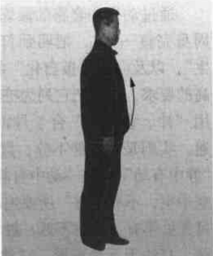  

【要领】  
（1）经云：“锁住心猿与意马，一心要立海底基。”即此意也。既要练功，就得排除杂念，精神集中，按技法要求去做。  
（2）先要站稳身形，头顶项直，呼吸自然，周身放松。  

#### （二）两前臂自然向胸前抬起，手心向下。  
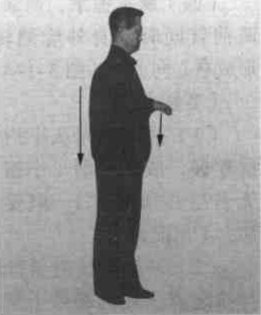  
【要领】  
（1）抬前臂时必须贴身提起，掌根拇指侧贴于心口旁。这是学习掌握“肘不离肋，手不离心”和“摩经”“手摩内五行”的技法要领。  
（2）不要耸肩、亮肘。  
（3）不要提气用拙力。  

#### （三）两前臂及掌根拇指侧贴身，随呼气自然下按，双掌停于丹田；两腿随之同时并膝下蹲。  
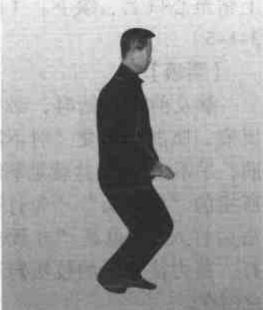    
【要领】  
（1）下按时上体要正直，头顶项直，垂肩，坠肘。必须于呼气时随呼气贴身（摩经）而下按，还要意注劳宫穴边按边塌掌根，使掌指保持原水平姿势下按。气要下沉，抱入丹田，两肘抱于两肋，拇指横平靠于丹田。  
(2) 两腿下蹲时，要跪膝，压踝，前膝向前，后膝紧靠于前膝里侧，成半蹲式。  
(3) 不得“凸臀”，而要“提肛”。腰要塌，上体保持与地面垂直。  

#### （四）两掌握拳，两拳和两前臂同时贴身外旋翻转，形成拳心向上。  
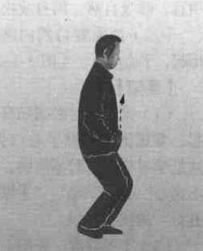
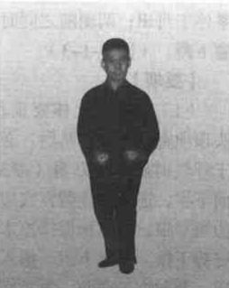  
【要领】  
(1) 握拳要先从小指依次卷握，成实心拳（小指与无名指必须握实），但要自然，不用拙力。  
(2) 外旋翻转时要微有拧拉之意，使两拳停于脐之两侧（图3-1-4附图），但两臂仍抱贴于两肋，不得稍离。  

#### （五）左拳及左前臂贴身上钻至心口上、颌下。  
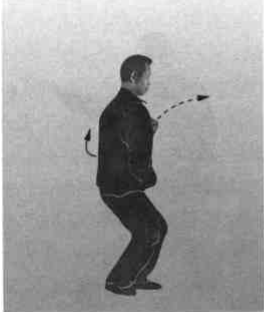  
【要领】  
拳及前臂上钻时，必须沉肩、坠肘，又要“肘不离肋，手不离心”，这就是拳经所指的“虎抱头”“先打顾法后打人”，也是“亦顾亦打，蓄力待发”的技法窍要之所在。  

#### （六）上动不停。
左拳及左前臂继续上钻，从颌下钻出，拳心向上，高不过眉；左脚同时前进一步，形成前三后七的夹剪步，即“桩步”。  
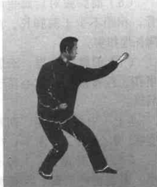
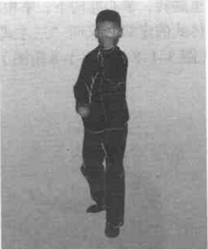  
【要领】  
（1）左拳要贴身从颌下嘴前钻出，即“虎抱头”的具体运用，亦即拳经所指“出洞入洞紧随身”。“洞”指的是人嘴。  
（2）拳的钻出，拳心要向外拧，有横劲不见横形，眼看小指窝。  
（3）出拳要顺腰拔背，肩催肘，肘催手。  
（4）上体要似正非正，似斜非斜。  
（5）出脚要腰催胯，胯催膝，膝催足。要手脚齐到。  
（6）前脚跟对后脚里踝骨，相距不少于两脚长，两脚抓地扣实。  
（7）前膝微前挺，后膝里扣，拧腰顺胯，重心落于后腿。  
#### （七）上势站稳后，两拳变掌，掌心向上。  
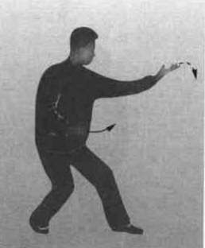    
#### （八）三体左式。
上势不停，眼看前臂肘窝，保持肘窝不变地往下向里翻转手掌和前臂，变为掌心向下，掌高与心齐。同时右前臂亦向里翻转，掌心亦向下，掌根靠于脐，拇指侧贴于腹。这就是三体式的定势，又叫“三才式”，也叫“鹰捉式”，是形意母式。  
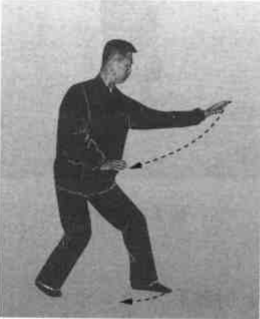
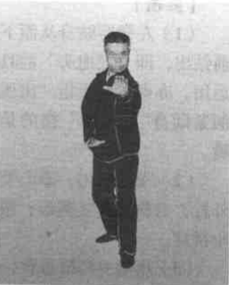  
【要领】  
（1）掌在翻转时，必须沉肩、坠肘，边翻转边沉坠，并向前抻拔，但上体不得前俯，臂不能伸直。  
（2）左肩、肘、手三点必须在一条前进的直线上。  
（3）鼻尖、手尖、脚尖三尖相对于同一前进方向（此在形意拳中称为“三尖对”）。  
（4）后臂要紧贴于肋侧，当翻转时，掌要边翻转边拧扣，但不用拙力。  
（5）两掌的五指要自然分开，掌型要做到手心圆、手背圆、虎口圆。    
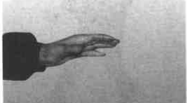
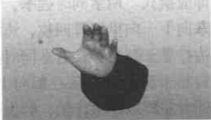    
（6）前手的掌指上翘，指端高出前臂 3~4 横指，约 45°，掌有顶扣之劲。  
（7）后手的掌指上翘要稍高，使掌根拇指侧平靠于脐。除手与臂外，周身其他各部位也应逐一按要领做到。  
（8）头要上顶，下颌内收，项自然伸直；两目从食指端注视前方；齿叩，舌顶上腭。  
（9）精神要集中，呼吸要在自然中舒胸实腹，气沉丹田，但不可故意砸气。  
（10）上体要顺胯（两胯前后相对），拧腰（与扣膝相反，即“龙折身”），形成似正非正，似斜非斜；上体与地面垂直，两肩要平，含胸拔背，切不可前俯后仰，左斜右歪，肛门要自然里收，不可凸臀。  
（11）前腿三成劲，后腿七成劲；前膝微前挺，后膝尽量里扣；前脚尖朝前，后脚尖外展，与前脚成45°左右夹角；前脚跟对后脚里踝骨，重心偏于后脚，但上体、臀部必须在脚跟以内（即足下存身）；两脚趾抓地落平扣实。  
（12）这些要领不得稍有疏忽，并应在基本熟练的情况下，应该再重温前述的“三体式的技法和效用”的具体内容，以加深理解，并求得精微而又切实地按进展程度加以运用。  

#### （九）上动站至后腿乏力即应换式。
两掌同时握拳，左拳向下、向里屈臂回拉，边拉边拧靠于脐左旁；右拳同时拧转靠于脐右旁，拳心都向上；同时左脚以脚跟作轴，脚尖里扣，与右脚成内八字；重心不变，目视左方。  
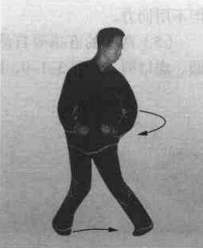    
【要领】  
（1）左拳要以肘拉拳、贴身，边拉边向外拧转，拉至脐旁时拳心拧成完全向上，右拳亦同时向外拧转移至脐旁。  
（2）左脚尖的里扣与左拳的回拉要做到手与脚、肘与膝上下相合，动作一致。注意不要俯身凸臀。  

#### （十）上动不停。
重心移至左腿，上体右转回身，收回右脚，右脚跟靠于左脚里踝骨，左膝微前顶，紧靠右膝里侧  
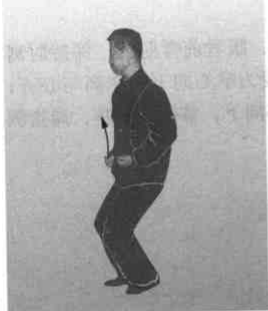    
【要领】  
重心移左腿时，不要凸臀，亦不要长身，姿势要保持原有高度。  

#### （十一）右拳及右前臂贴身上钻至心口。  
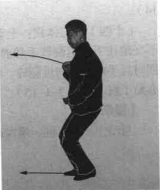  
【要领】  
要沉肩、坠肘、贴身钻起，与动作（五）同，左改为右。

#### （十二）上动不停。
右拳及右前臂继续上钻，从颏下嘴前钻出，拳心向上，高不过眉；右脚同时前进一步，形成前三后七的夹剪步。   
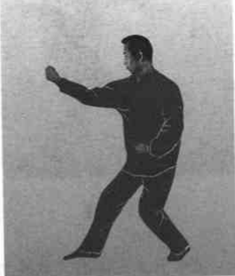  
【要领】  
与动作（六）同，唯左改为右。
#### （十三）上动站稳后，将两拳变掌，掌心向上。  
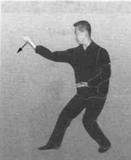  

#### （十四）右三体式
上动不停，眼看前臂肘窝，保持肘窝不变地往下向里翻转手和前臂，变为掌心向下，掌高与心齐；同时后手前臂亦向里翻转，掌心亦向下，掌根靠于脐，拇指侧亦贴于腹。  
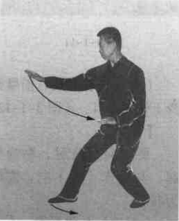  

【要领】  
与动作（八）同，唯左改为右。
#### （十五）三体右式欲换为左式
其转换动作要领与前述之动作（九）、动作（十）、动作（十一）、动作（十二）、动作（十三）、动作（十四）同，唯左右相反。参看下图以下左右转换皆按此做。

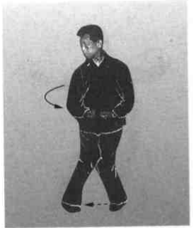
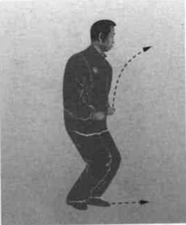
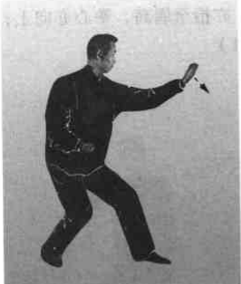
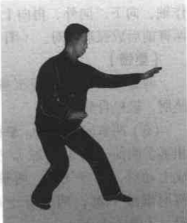      
#### （十六）收势  
(1) 两掌同时握拳。（图3-1-20）      
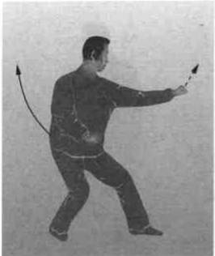
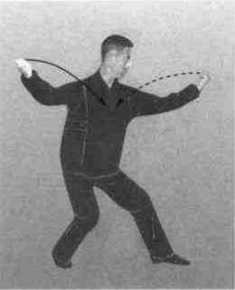  
【要领】  
形意拳起势必须是左手、左脚在前，而收势亦必须如是。  
（2）前拳向外翻转，抬至眉高，拳心向上，同时后拳以肘作轴，向下、向外、再向上翻转，亦抬至眉高，拳心亦向上；两臂前后成弧形相对。(图3-1-21)  

【要领】  
两臂翻转时，仍要沉肩、坠肘，轻松自然。

（3）两拳向里并拢，拳面相抵于胸前。  
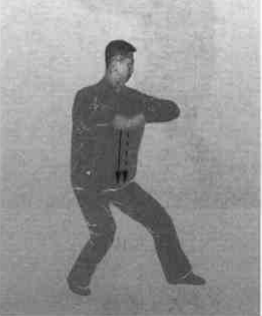

完成上动后，待呼气时，两拳、两肘继续下沉，两拳停于丹田。  
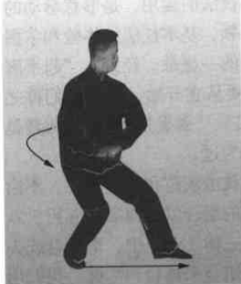  

【要领】  
两拳、两肘边向里并拢边微下沉，抵于胸前要贴身，待呼气时随两拳下落，气亦沉入丹田。动作要轻松自然。  
（4）上体微左转，身向正前方；后脚上步，与前脚并拢。  
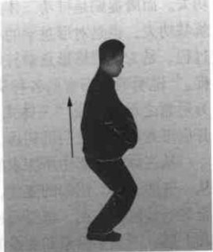  
（5）两拳自然张开变掌，随两腿自然伸直起立，同时，两臂也自然放下，成并脚立正姿势。  
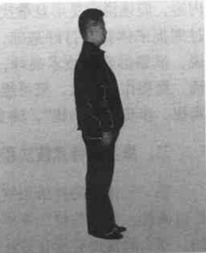  
