> 摘至李文彬先生与尚芝蓉女士合著的《尚派形意拳械氛微》的第三章 筑基功夫的第二节：母拳——鹰捉  
## 一、鹰捉的涵义和作用
桩功三体式被视为是形意拳特有技法静的定型，静的筑基功夫。而鹰捉则是桩功三体式诸多技法的运用，是形意拳动的筑基功夫，也是对形意拳的动作要领、基本技法的体验和掌握过程，是为了锻炼形意拳打好基础的一趟拳。经云：“起手鹰捉。”说明锻炼形意的各种拳法都要从它开始，所以人们称之为形意之母拳。说“三体式是母式”“鹰捉是母拳”，两者是开启形意拳奥秘之门的钥匙，实不为过。

从三体式静态中所探求的种种技击规范和技法窍要，不论从一气的运行、阴阳的变化、三体的组合以及四象、五行、六合等等技法的运用，都要通过动的三体（上、中、下三盘或头和上肢、下肢）因素和变换的三体组合来体验和掌握。我们用动的三体式——鹰捉来实现它，可以说是最容易掌握，也是最有效果的捷径。前面所介绍的有关“三体式的技法和效用”的内容，应该说它是形意拳技法的菁华部分，而这些菁华只有通过鹰捉来体验，打好基础，才能进而求得会运用。再进一步说，欲攀形意拳技术高峰，也只有依靠它掌握要旨，求得真谛。鹰捉作用之大，概可想见。无怪前人有句名言“把把不离鹰捉，步步不离鸡腿”，确实道出了其中的窍要。

## 二、鹰捉的特殊技法和效用

在“三体式的技法和效用”文中，已把形意拳的技法菁华作过阐述，而这些技法菁华是要通过鹰捉来体验、运用和提高的。那么鹰捉还有没有另外的技法？有！因为鹰捉是形意的母拳，如果说它还有特殊技法，是体现形意拳技法核心的东西，而这个核心也正是上述形意拳的一些技法菁华的荟萃结晶，没有上述那些技法菁华的融会贯通，也产生不出这个结晶。从另一面讲，这些技法菁华是为这个技法核心服务的。形意拳的技法核心，概括地来说就是“起落、钻翻劲”。而我们对于鹰捉千锤百炼、孜孜以求的也正是为了它。形意拳的五行、十二形等拳，虽多种多样，且各具特点，但哪趟拳也没有鹰捉这趟拳体验“起落、钻翻”劲最深切，最明显。换句话说，只有先通过练它才能找着、练到这种真劲。所以说鹰捉的特殊技法就是“起落、钻翻”劲。我们形意门中特有的、被人们景仰和追求的“翻浪劲”（人们不知其名，仅从动作形态来看，叫它“摩擎劲”，也有叫它“划劲”的），就是这“钻翻劲”中的代表形式。

我们练鹰捉，要从自然，和谐中练出“上下相随，内外合一”的整劲来。再从开展、轻松中练出迅猛刚实的爆发劲来，使内劲由无到有，以求逐渐充盈。经云：“静若处女，动若脱兔”“不发缓若轻风，既发迅如奔雷”。我们就是要练出这种节奏和气势来！至此方可说对形意的技法已能领会，对它的戏劲路略知所以。达此程度，自会体现出“刚至柔生，柔极自化”的拳意精髓的道理来。既得疾用骤发，迅如奔雷的爆发刚劲，就有了发人的真正本钱，再能稍加用心去领悟，则缓动遂发的柔（暗）劲，也会悠然而得，形意拳发劲技法的精华之一的属于柔（暗）劲的所谓“中乘”功夫的“沾身纵力”，也会自然地逐步得之。人们或知“沾身纵力”之言，却多不知“沾身纵力”其技，实际它就是“起落、钻翻”的具体应用。也只有通过练鹰捉，用鹰捉，才能逐渐地懂得它和找到它（须得明师的指教），才能真正深切地体验到它。有了这个体验才能推而广之，运用到形意的其他拳法中去。人们称鹰捉为形意之母拳，信乎！它确实当之无愧。

但是对于这趟，练形意的人多管它叫“劈拳”，把它当劈拳来练，这是令人遗憾的错误。它既不是握拳，又用的是俯掌，根本不符“劈拳”似斧之形，没有“斧刃”又从哪能练出似斧之劲？且形意各拳是用它来作为“起手”的。“起手鹰捉”，已经早有定名，还拿它当劈拳，显然是错误的。特别值得提出的是丢掉了真正的劈拳，便失掉了劈拳不用关节处打人、发劲的非常宝贵的特殊技法，良可惜也。  

## 三、鹰捉的具体练法

#### （一）预备势（即原地左鹰捉）

1. 两脚跟对齐，立正，其他领与三体式之动作（一）同。(图3-2-1)
2. 与三体式之动作（二）同。（图3-2-2）  
3. 与三体式之动作（三）同。（图3-2-3）  
4. 与三体式之动作（四）同。（图3-2-4）  
5. 右拳及右前臂贴身沿中线上钻至胸部颏下（图3-2-5）。  

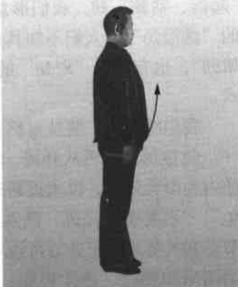
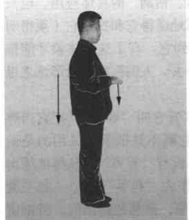
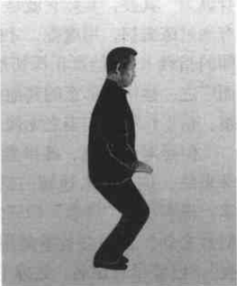
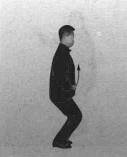
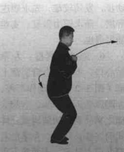

动作不停，右拳及右前臂继续从颏下向前上方、向外拧转钻出，高不过眉。（图3-2-6）  
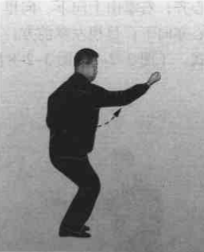    
【要领】   
（1）如图 3-2-5，即“虎抱头”之蓄力待发。  
（2）右拳从颏下钻出，必须贴身从嘴前边钻边拧转，此即“出洞入洞紧随身”的技法要求，亦即“虎抱头”的具体运用。不论单臂、双臂皆此涵义。  
（3）钻出之拳，拳心外拧，有横劲但不见横形，这就是“起横不见横”的技法涵义。眼要看小指窝。  
（4）出拳要顺腰拔背，肩催肘，肘催手。上体要似正非正，似斜非斜。  
（5）此右拳的钻出，不动步，发劲较难，先求顺遂舒展，渐求腰力得发，实难能可贵也。  

6. 原地左鹰捉：左拳贴心口，上钻至右臂肘窝上部（图 3-2-7）；  
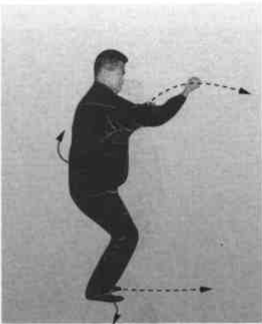  
动作不停，左脚向前迈出一步，右脚尖随之稍外展，两腿构成三体式的桩步；同时，左拳沿右臂向前上钻出，当两拳上下相遇时，两拳同时里拧转变成“三圆掌”；左掌由上向前、向下翻落，掌心向下，掌高与心齐；右掌由上向下、向里，肘贴肋回拉，靠在脐之右侧，掌心亦向下；目视左掌前方；至此构成原地左鹰捉，亦即左三体式。（图 3-2-8、图 3-2-8 附图）  
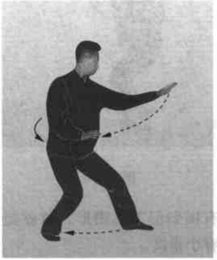
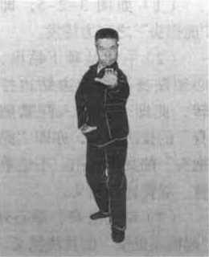   
【要领】  
（1）原地鹰捉，不借后脚蹬进跟步，只是稍借重心变化而原地能发劲的高度技巧。虽然每趟拳开式都练它，有的人仍感不足甚至单练它。但是，有的人为了省事而不练它。只一摆三体姿势就罢。两者得失却大有差异。
（2）左脚迈出、右脚尖外展必须符合前蹬对后踩的桩步的要求。
（3）要充分体现“起落、钻翻”的特殊技巧和完整劲。

图 3-2-1~3-2-8 的动作全过程，即尚派形意拳每趟拳开始的预备势（有少数例外）。“起手鹰捉”即指此。本书所写的五行、连环拳都用它做预备势，以下从略。

#### （二）进步右鹰捉

1. 撤半步回收：接上动。左手抓握变拳，继而坠肘贴肋回拉，边回拉左前臂边外旋，使拳心向上，停于脐之左侧；与此同时，右掌也变拳，外旋微回拉，停于脐之右侧；当左拳旋转回拉时，左脚亦同时回收，紧靠于右脚里踝骨，脚尖、膝尖向前；右膝紧靠左膝里侧；目视前方。（图 3-2-9）    
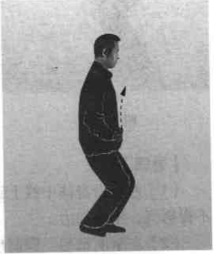  
【要领】  
（1）变拳时要从小指卷起，握实心拳，不得用拙力。回拉时拳及前臂要拧转并用腰劲。  
（2）左脚回收与两拳拧转回拉要动作、劲力一致，不得长身，保持原有高度。  
2. 提步左钻：左拳向里拧转沿身体中线上钻至颏下（图3-2-10）；动作不停，右脚屈膝后蹬，左脚贴地向前趟进，踩落，右脚随即向前跟进，提靠在左脚里侧，右脚踝骨压靠在左脚踝骨之上，即右提步；在左脚趟进的同时，左拳由颏下向前上方、向外拧转钻出，高不过眉，拳心斜向外，小指处拳眼向上；目视左拳。（图3-2-11）

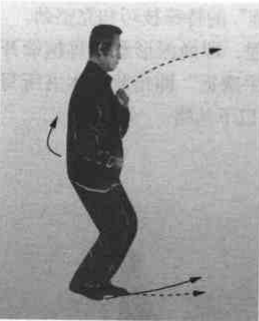
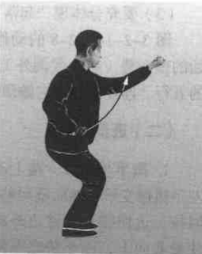   
【要领】    
（1）左拳沿身体中线上钻时，要“肘不离肋，手不离心”，不得努气，不用拙力。  
（2）左拳前钻与左脚前趟要同时进行，做到上下相随。要沉肩、坠肘、发腰劲，做到腰催肩、肩催肘、肘催手。上体保持似正非正，似斜非斜，发挥“龙折身”的作用。  
（3）右脚提步，右脚里踝骨压靠在左脚里踝骨之上时，右脚尖翘起，脚掌要平；所有提步，分别左、右，两脚都按此要求，下略。  
（4）提步时重心要稳，不得左右摇摆。  
3. 上步右鹰捉：右拳贴心口上钻至左臂肘窝上部（图 3-2-12）；动作不停，左脚后蹬，右脚向前用力趟进踩落，左脚随即向前跟进半步，成右三体式；与此同时，右拳沿左臂向前上钻出，当两拳上下相遇时，两拳同时里拧变掌，右掌则由上向前、向下翻落，掌心向下，高与心口齐；同时左掌由上向下、向里翻转贴肋回拉，靠在脐之左侧，掌心向下；目视右掌前方。（图 3-2-13）

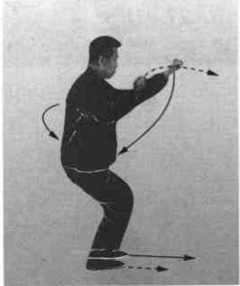
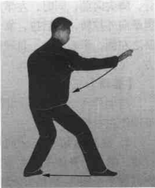

【要领】  
（1）右掌翻落时要沉肩，坠肘用腰劲，要做到“三尖”对。要利用“三催”之劲，伸出“三星”，力达梢节。左掌翻转回拉要与右掌向前翻落的动作、劲力协调一致，两掌有拧转撑拔之劲。  
（2）左脚后蹬，右脚前趟、踩落要与右掌的翻落同时完成，以做到“手脚齐到才为真”的技法要求。起钻落翻要如“水之翻浪”走弧形。动作要从舒展、自然中求得上下和谐；从自然、和谐中的完整一致逐步求得迅猛刚实，以练好刚劲。在行进中身体不可有起伏。

#### （三）进步左鹰捉
1. 撤半步回收：右掌握拳向下、向里贴肋腹回拉，边拉边向外拧转，靠于脐之右侧，拳心向上；与此同时，右脚亦贴地回收，靠于左脚里踝骨，脚尖向前；同时，左掌亦握拳向外拧转，微后拉，靠于脐之左侧，拳心向上；目视前方。  
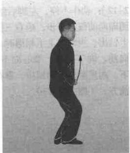  
【要领】  
同动作（二）之 1 动同，唯动作左右相反。
2. 提步右钻：右拳向里拧转，继而沿身体中线上钻至胸部颏下（图 3-2-15）；动作不停，左脚屈膝后蹬，右脚贴地向前趟进、踩落，左脚随即向前跟进提靠于右脚里侧，即左提步；与右脚趟进的同时，右拳由颏下、嘴前，向前上方、向外拧转钻出，右拳高不过眉，拳心斜向外，小指处拳眼向上；左拳在原处配合右拳沉劲，紧靠于脐之左侧；目视右拳。(图3-2-16)  
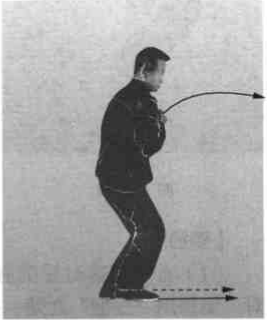
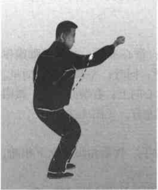    
【要领】  
同动作（二）之 2 动，唯动作左右相反。  
3. 上步左鹰捉：左拳贴心口上钻至右臂肘窝上部（图3-2-17）；动作不停，右脚后蹬，左脚向前用力趟进，踩落；右脚随即跟进半步，成桩步；与此同时，左拳向前、向上钻出，与右拳上下相遇时，两拳同时变掌，左掌则由上向前、向下翻落，掌心向下，高与心齐；同时右掌由上向下，向里翻转贴肋回拉，靠在脐之右侧，掌心向下；目视左掌前方。（图3-2-18）  
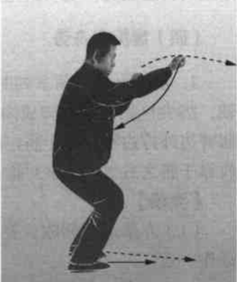
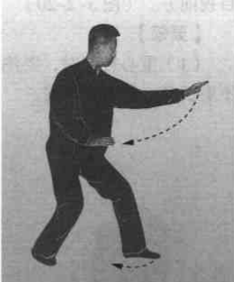    
【要领】  
同动作（二）之3动，唯动作左右相反。  
如此左式、右式反复交替练习，动作多少视场地的大小、路线的长短而定，现以做完左鹰捉回身为例，转身往回练。

#### （四）鹰捉回身势

扣脚收拳：两掌同时握拳；重心不变，左脚以脚跟作轴，脚尖里扣，与右脚成内八字形；同时，左拳向下、向里，屈臂边外拧边回收靠于脐左侧，拳心向上；右拳亦外拧，微回收靠于脐之右侧，两拳对称；目视左方。（图 3-2-19）

【要领】  
（1）左拳屈臂回收，要用肘拉手。收拳扣脚要上下相随，动作一致。  
（2）左拳与右拳外拧束身，动作与劲力亦要完整一致。  

转身收脚：上动不停。上体右转，重心移至左脚，右脚以前脚掌为轴，脚跟里转，贴地回收，靠于左脚里踝骨处；目视前方。（图 3-2-20）  

【要领】  
（1）重心转移时，要注意保持身体正直，不可前俯后仰，不要长身，更不要凸臀。  
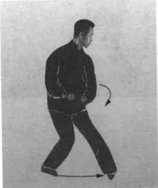
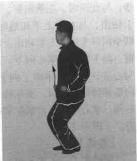  
（2）右脚回收，右脚尖、右膝朝前，左膝里扣，贴于右膝窝里侧，两腿要靠紧。  

#### （五）进步左鹰捉
动作要领同动作（三）。  
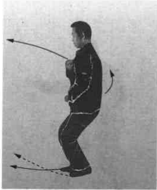
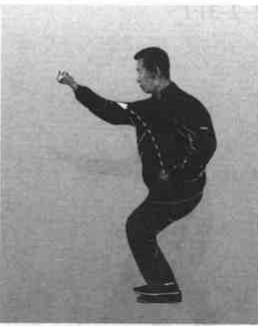  
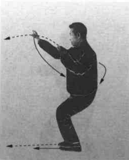
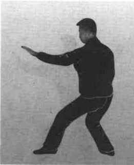  
以下仍可左、右式交替练习。练到鹰捉起势端，回身后，练完左势（图 3-2-25）即可收势。如中途欲收势，亦必须在练完左势时方可收势。

#### （六）鹰捉收势
动作及要领与三体式收势同，文字从略。  
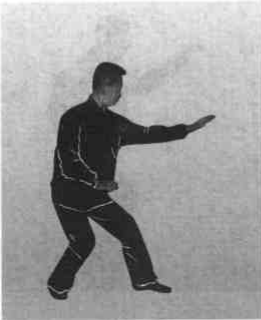
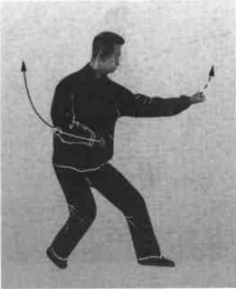  
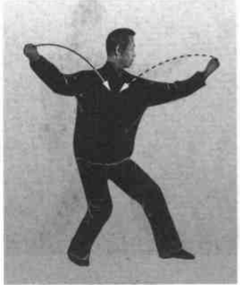
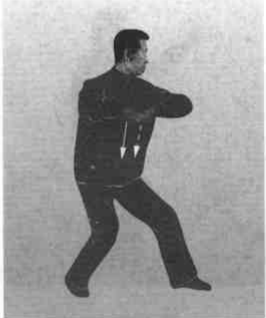  
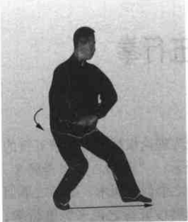
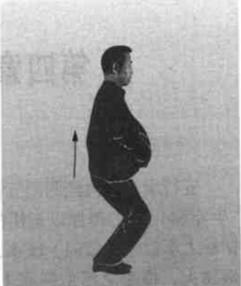  
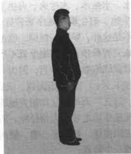
